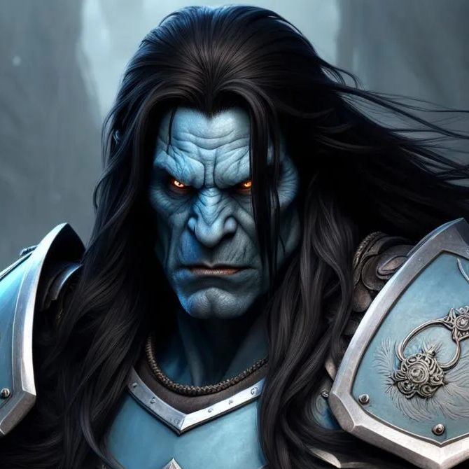

# Grug

> 

## Character Details 

|                   |                 |
| :---------------- | --------------: |
| **Class / Level** | Fighter Lvl 3   |
| **Race**          | 3/4 Orc         |
| **Background**    | Folk Hero       |
| **Alignment**     | Chaotic Neutral |
| **Age**           | 27              |       
| **Height**        | 200cm           |
| **Weight**        | 140kg           |
| **Eyes**          | Yellow          |
| **Skin**          | Pale Blue-Grey  |
| **Hair**          | Long Black Hair |

### Personality Traits
- I judge people by their actions, not their words.

- Thinking is for other people, I prefer action.

### Ideals
- Might: If I believe in strength.

- Destiny: nothing can stop me.

- Sincerity: no use for pretending.

### Bonds
- I worked the land, I love the land, I will protect the land. 

### Flaws
- Impulsive 

- Does not think about the long term

## Stats 

| Attribute           | Value     | Modifier |   
| :------------------ | :-------: | -------: |
| Strength            | 18        | +4      |
| Dexterity           | 16        | +3      |
| Consitution         | 16        | +3      |
| Intelligence        | 10        | +0      |
| Wisdom              | 14        | +2      |
| Charisma            | 12        | +1      |

**Proficiency Bonus:** +2

**Inspiration:** [ ]

## Saving Throws

| Proficiency | Modifier | Attribute        |
| ----------- | -------- | ---------------- |
| x           | +6       | Strength         |
|             | +3       | Dexterity        |
| x           | +5       | Constitution     |
|             | +0       | Intelligence     |
|             | +2       | Wisdom           |
|             | +1       | Charisma         |

## Skills
[ ] +3 Acrobatics (Dex)

[x] +4 Animal Handling (Wis)

[ ] +0 Arcana (Int)

[x] +6 Athletics (Str)

[ ] +1 Deception (Cha)

[ ] +0 History (Int)

[ ] +2 Insight (Wis)

[x] +3 Intimidation (Cha)

[ ] +0 Investigation (Int)

[ ] +2 Medicine (Wis)

[ ] +0 Nature (Int)

[x] +4 Perception (Wis)

[ ] +1 Performance (Cha)

[ ] +1 Persuasion (Cha)

[ ] +0 Religion (Int)

[ ] +3 Sleight of Hand (Dex)

[ ] +3 Stealth (Dex)

[x] +4 Survival (Wis)

## Combat
### Overview
- Armour Class: 18

- Initiative: +3

- Speed: 30ft

### Hit Points
- Hit Point Maximum: 34

- Current Hit Points: 34 

- Temporary Hit Points: 

### Hit Dice
d10

### Death Saves
Successes: [] [] []

Failures: [] [] []

### Actions
- Name: Longsword, Attack Bonus: + 6, Damage: 1d8 +6 Slashing 

## Battlemaster Superiority Dice
4 d8 superiority die (regenerate per short / long rest)

- [ ] 
- [ ] 
- [ ] 
- [ ]

### Maneuvers 

#### Trip Attack
When you hit a creature with a weapon attack, you can expend one superiority die to attempt to knock the target down. You add the superiority die
to the attack’s damage roll, and if the target is Large or smaller, it must make a Strength saving throw. On a failed save, you knock the target prone.

#### Disarming Attack 
When you hit a creature with a weapon attack, you can expend one superiority die to attempt to disarm the target, forcing it to drop one item of your choice that it’s holding. You add the superiority die to the attack’s damage roll, and the target must make a Strength saving throw. On a failed save, it drops the object you choose. The object lands at its feet.

#### Precision Attack
When you make a weapon attack roll against a creature, you can expend one superiority die to add it to the roll. You can use this maneuver before or after making the attack roll, but before any effects of the attack are applied.

## Features / Traits
- [ ] Second Wind: Once per short rest, use bonus action to regain 1d10 + 1 HP

- [ ] Relentless Endurance: When reduced to 0HP but not killed, drop to 1HP instead. Can only be used once per long rest.

- [ ] Second Wind: On bonus action regain hp 1d10 +  fighter level. Once per short rest.

- [ ] Action surge: On turn take an additional action. Once per short / long rest. 

- Fighting Style - Dueling: 1H melee +2 bonus to damage rolls

- Dark Vision: 60ft (can only see in grey)

- Savage Attacks: On critical hit, roll 1 of the weapon's dice and add to extra dmg.

- Rustic Hospitality: Fit among common folk with ease. Can find a place to hide and rest among commoners, unless you have shown to be a danger. This will shield you from the law or someone looking for you, but they will not risk their lives for you.

## Other Profieciencies / Languages
- Languages: Common, Orc

- Menacing: proficiency in intimidation

- Armour: Heavy, Medium, Light, Shields

- Weapons: Martial, Simple

- Tools: Blacksmith tools, vehicles (land)

## Coin
- Copper Pieces: 

- Silver Pieces: 

- Gold Pieces: 110

## Equipment
- [x] Chain Mail (75GP)

- [x] Long sword (15GP)

- [x] Cool Shield (10GP)

- Light crossbow w/ 20 bolts

- Dungeoneer's Pack

- Blacksmith's tools

- Shovel

- Iron pot

- Common Clothes

- 1 lessor healing potion d4

- 5 bottles of clear liquid

- 5 bottles of blood "grog"

- 1 shield

- 1 art of smithing book

- Transcribed curse note

- 2x short sword

## Character Backstory
Grug grew up in the northern icy tundras in a village called Grug. His mother was an orc and his father a half-orc. All males in this village are called "Grug" and the females "Grugetta". Their culture centres around battle, and it is considered a great dishonor to grow old, as it suggests you did not fight worthy foes. Both men and women are expected to fight, and all Grug villagers are proficient blacksmiths. It is customary to go on a death pilgrimage during your physical peak, with the goal being to die with glory. Grug has left his wife Grugetta in the village to go on his own death pilgrimage, where they both hope he finds an honorable death. 

### Folk Hero Defining Event
Grug's father was not a typical Grug, he hated violence and spent his days writing poetry. Everyone hated him. He refused to go on his death pilgrimage and had grown very old (38 years old) without having any battle scars. One day he was performing his poetry in the village square when Grug finally had enough. He challenged his father to a death duel, which cannot be refused if issued by direct kin. Even Grug's father knew he could not decline. He begged Grug to seek a path of non-violence. Instead, Grug decapitated him, causing the village to cheer and so Grug became the village hero. His mother is very proud of him.
